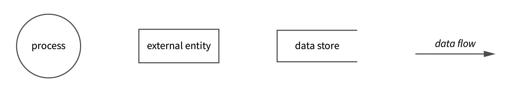
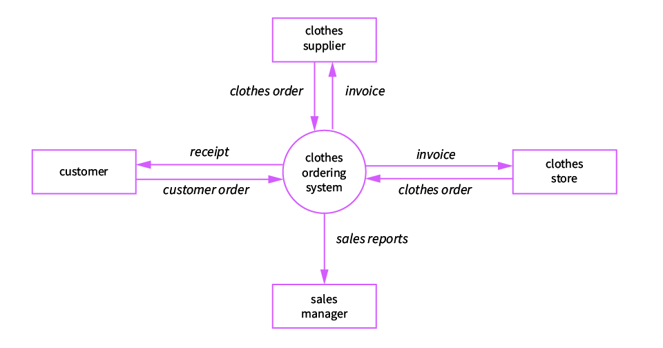
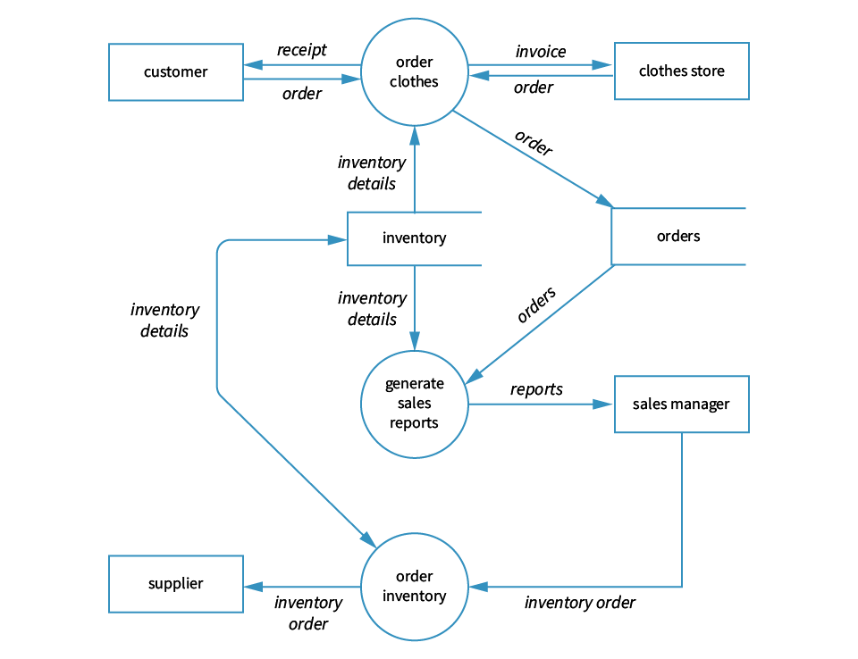

# 113 Data flow diagrams

### Data flow diagrams

A data flow diagram (DFD) graphically represents a data flow within a system. It illustrates how data is input and output from the system and shows destinations, storage, and sources of the information in the system. In other words, DFDs represent the information flow, where data comes from, where it goes and how it is stored.

DFDs have four elements represented by four different symbols.

* **Processes**\
  The main activities that are happening within the system boundary. The process can be as simple as collecting and storing customer data in the company database. It can also be very complicated, such as creating a report containing bank contracts with customers of all regional bank clones.
* **External entities**\
  External entities are the sources of information coming to or leaving the system. They include outside systems such as people (customers, stakeholders, managers), organizations, computers, and other systems that send or receive data from our system.
* **Data stores**\
  Data is consistently held in these places, such as files or repositories. Data stores show information that is not moving.&#x20;
* **Data flows**\
  These arrows represent data's movements between the external entities, data stores, and the processes.

<figure><figcaption>
The four symbols used in data flow diagrams.
</figcaption></figure>

### Creating data flow diagrams

Here are some rules for creating data flow diagrams.

1. Each **process** has at least one input and output data source, representing an input-process-output (IPO) diagram.
2. Each **process** can move data to other processes, data stores, and/or entities.
3. Entities must be connected to a process by a data flow.
4. Data flow should not cross one another.
5. Data stores cannot be connected to external entities. This would allow an external entity to access tje system files and data stores.

#### Level 0 DFD

A context data flow diagram (also called Level 0 diagram) uses only one process to represent the functions of the entire system.The purpose is to express the system scope at a high level before decomposition. A context diagram shows the system boundaries which is where the external entities are repesented.

* Simple to draw.
* No need of technical knowledge to understand it.
* Shows the system boundaries.

To create a Level 0 (context) diagram)

1. Define the process.
2. Create a list of all external entities (all people and systems).
3. Create a list of the data flows.
4. Draw the diagram.

Let’s illustrate the things with a context data flow diagram example. Below is shown&#x20;

<figure><figcaption>
A simple context DFD for a retail clothes ordering system
</figcaption></figure>

#### Level 1 DFD

The Level 0 (context) DFD contains only one process and does not show any data stores. This is the principle difference in a level 1 DFD. The main process is deomposed into sub-processes that can then be seen on a deeper level. Also, a level 1 DFD contains data stores that are used by the main process.

To create a level 1 DFD

1. Define the processes (the main process and the sub-processes).
2. Create a list of all external entities (all people and systems).
3. Create a list of the data stores.
4. Create a list of the data flows.
5. Draw the diagram.

<figure><figcaption>
A level 1 DFD for the retail clothes ordering system now shows three processes, four external entities, and two data stores.
</figcaption></figure>
