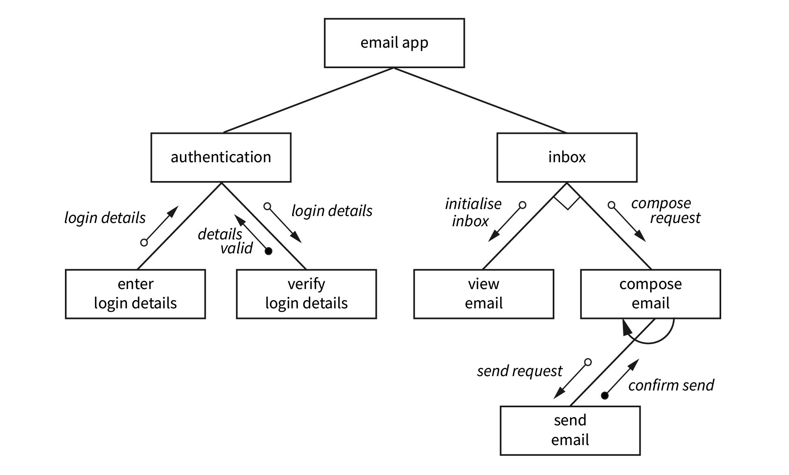

# Solutions

### Question 1

Define the following terms for structure charts and give examples: module, sub-module, and flag.

See answer

* **External Entity**\
  In DFDs, an external entity represents sources or destinations of data outside the system, such as users or external systems. \
  &#xNAN;_&#x45;xample:_ In a banking system, a Customer is an external entity.

- **Data Store**\
  A data store in DFDs symbolizes where data is stored within the system, like databases or files. \
  &#xNAN;_&#x45;xample:_ A Customer Database storing user information.

* **Process**\
  Processes in DFDs depict activities that transform inputs into outputs. \
  &#xNAN;_&#x45;xample:_ Process Payment converts payment details into transaction records.

- **Module**\
  In structure charts, a module is a distinct unit of code that performs a specific function. \
  &#xNAN;_&#x45;xample:_ A User Authentication module handles login procedures.

* **Sub-Module**\
  A sub-module is a component of a module that carries out a subset of the module’s functionality. \
  &#xNAN;_&#x45;xample:_ Within the User Authentication module, a Password Verification sub-module checks user passwords.

- **Flag**\
  A flag is a variable indicating a particular condition or status within the system. \
  &#xNAN;_&#x45;xample:_ An isLoggedIn flag that is set to true after successful user authentication.

### Question 2

Use a table to compare DFDs and structure charts.

See answer

| **Aspect**       | **Data Flow Diagrams (DFDs)**                                                                                   | **Structure Charts**                                                    |
| ---------------- | --------------------------------------------------------------------------------------------------------------- | ----------------------------------------------------------------------- |
| Purpose          | Illustrate how data moves through a system                                                                      | Show the hierarchical organisation of system modules                    |
| Focus            | Data processes, flows, and storage                                                                              | Functional decomposition and module relationships                       |
| Representation   | Processes, data flows, data stores, external entities                                                           | Modules, sub-modules, control structures                                |
| Hierarchy Levels | Context diagram (Level 0), Level 1, Level 2, etc.                                                               | Top-down decomposition into modules and sub-modules                     |
| Use Case         | Understanding data processing and storage                                                                       | Designing program structure and module interactions                     |
| Notations Used   | Circles/ovals (processes), arrows (data flow), open-ended rectangles (data stores), squares (external entities) | Rectangles (modules), arrows (control flow), diamonds (decision points) |

### Question 3

Discuss the nested hierarchy of structure charts.

See answer

Both DFDs and structure charts utilize nested hierarchies to represent system details at varying levvels of abstraction.

* **DFDs**\
  Begin with a high-level Context Diagram (Level 0) showing the system’s interaction with external entities. Subsequent levels (Level 1, Level 2, etc.) break down processes into more detailed subprocesses, providing a deeper understanding of data flows within the system.
* **Structure Charts**\
  Start with a top-level module representing the overall system function. This module is decomposed into smaller sub-modules, each handling specific tasks. This hierarchical breakdown continues until reaching modules that perform atomic operations, ensuring clarity in system functionality and module interactions.

#### **Questions 4-9 are based on the structure chart below for an email application.**

<figure><figcaption></figcaption></figure>

### Question 4

List the main modules and submodules shown in the structure chart of the email system.

See answer

**Main modules**

• Authenticate user

• Manage mailbox

**Sub-modules**

* enter login details
* verify login details
* view email
* compose email
* send email

### Question 5

Describe the process and sequence when users log into their email accounts and view their messages. Include any decision points involved.

See answer

1. **Authenticate User**\
   The user enters their login credentials, which are processed by the Authenticate User module.
2. **Verify Login Details**\
   The system verifies the credentials through the Verify Login Details submodule.
3. **Decision Point**\
   If the credentials are valid, the system proceeds; otherwise, it prompts the user to re-enter their credentials.
4. **Retrieve User Data**\
   Upon successful authentication, the Retrieve User Data submodule fetches the user’s email data.
5. **Display Inbox**\
   The Display Inbox submodule presents the list of received emails to the user.
6. **Open Message**\
   The user can select an email to read, which is handled by the Open Message submodule.

### Question 6

How does the **verify log in details** module interact with the other system components?

See answer

The Verify Login Details submodule interacts with the following components:

* **Authenticate User Module**\
  Receives user credentials from the Authenticate User module and verifies their accuracy.
* **Retrieve User Data Submodule**\
  Upon successful verification, it triggers the Retrieve User Data submodule to access the user’s email information.
* **Decision Logic**\
  If verification fails, it prompts the system to request re-entry of credentials or deny access.Answer

### Question 7

Explain the decision-making process represented by the diamond symbol. What choices are available, and how does the system proceed based on the decision made?

See answer

The diamond symbol represents a decision point where the system evaluates the validity of user login credentials:

* **Valid Credentials**\
  If the credentials are correct, the system proceeds to retrieve and display the user’s inbox.
* **Invalid Credentials**\
  If the credentials are incorrect, the system would prompt the user to re-enter their login information or denies access after multiple failed attempts.

### Question 8

Outline the sequence of events that occurs when a user sends a message. How do the 'compose email' and 'send email' modules interact, and what happens once the message is sent?

See answer

1. **Compose Email**\
   The user creates a new email using the Compose Email module, which may involve writing the message, adding recipients, and attaching files.
2. **Send Email**\
   Upon initiating a send, the Send Email module processes the outgoing message, and asks for confirmation.
3. **Confirm Send**\
   After initiating sending, the system asks the user to confirm they are ready to send the email.

### Question 9

How does the system handle login verification? Describe the interaction between the **enter login details**, **verify log in details**, and **authentication** modules, including what happens if the login details are incorrect.

See answer

1. **Enter Login Details**\
   The user inputs their username and password.
2. **Authenticate User**\
   The Authenticate User module receives these credentials and passes them to the Verify Login Details submodule.
3. V**erify Login Details**\
   This submodule checks the credentials against stored user data.\
   If Correct: The system proceeds to retrieve and display the user’s inbox.\
   If Incorrect: The system prompts the user to re-enter their credentials. After multiple failed attempts, access may be temporarily blocked or additional security measures initiated.

