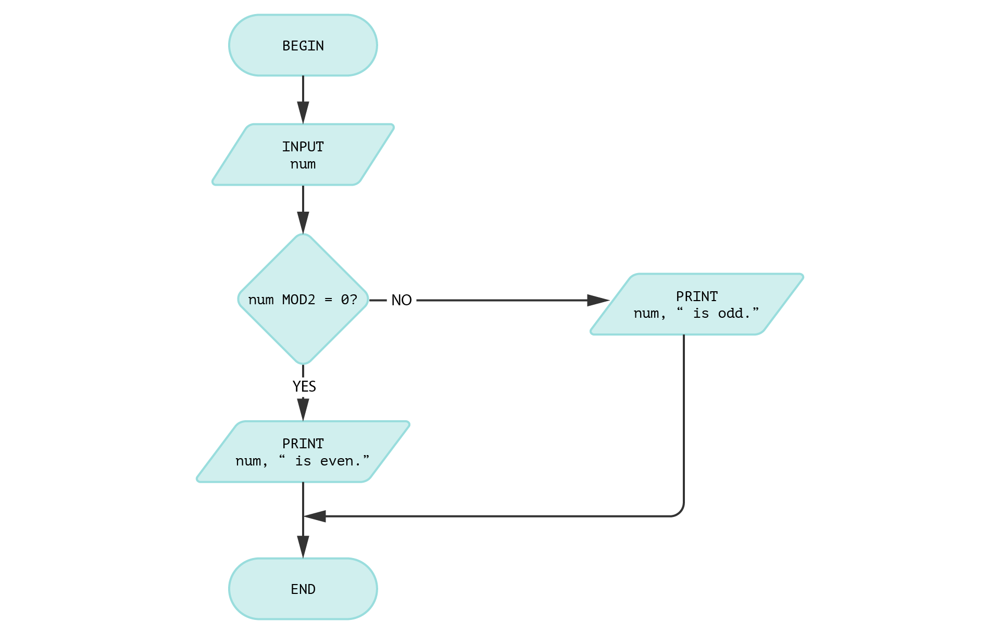
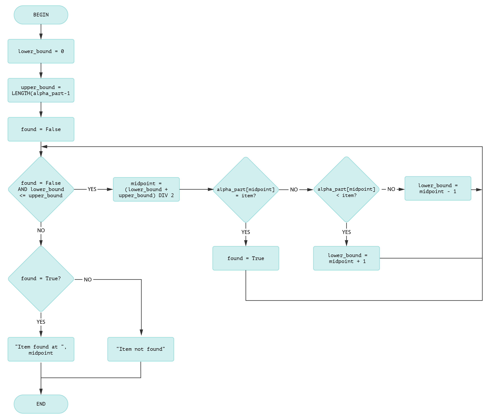
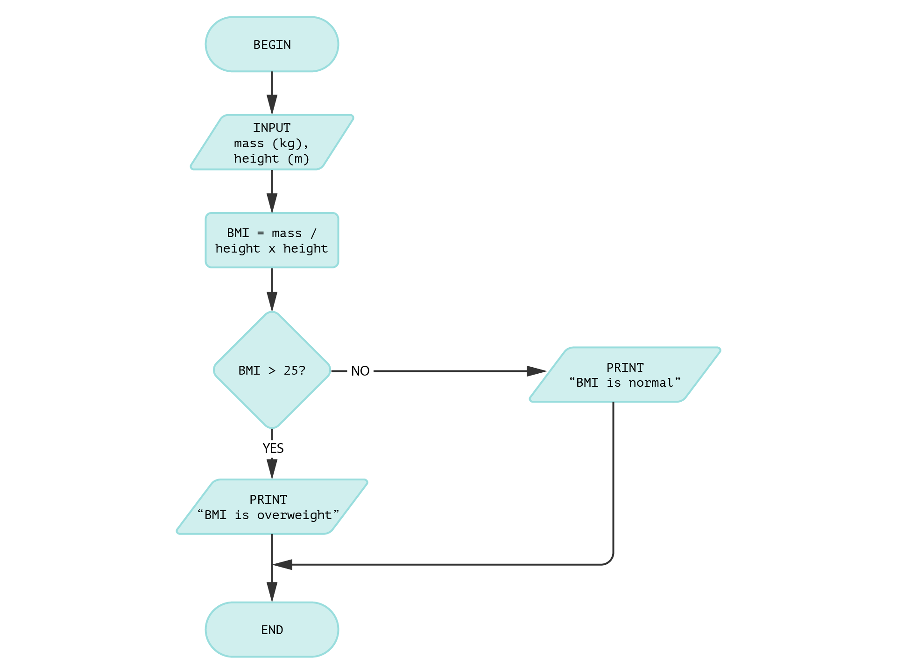

# 121 Algorithm fundamentals

Specific sets of logical instructions need to be provided to program a computer. A computer's set of logical instructions can be designed only when the programmer thinks like a computer processes the instructions. An algorithm is the set of logical instructions used to program a computer.

Designing a proper algorithm plays a vital role in the software development process. An algorithm is generally written using pseudocode or flowcharts. Pseudocode is a readable description of what a computer program will do, and a flowchart is the graphical representation of pseudocode. This section discusses various statements and structures used in pseudocode and symbols used in flowcharts.



In this section, students learn to

* apply a systematic problem-solving approach using algorithms.
* use tools to design and represent algorithms.
* analyse and interpret algorithms.



New South Wales Education Standards Authority (2022). _Software Engineering 11–12 Syllabus_. NSW Curriculum. [https://curriculum.nsw.edu.au/learning-areas/tas/software-engineering-11-12-2022](https://curriculum.nsw.edu.au/learning-areas/tas/software-engineering-11-12-2022/overview)

[**Programming fundamentals / Designing algorithms**](https://curriculum.nsw.edu.au/learning-areas/tas/software-engineering-11-12-2022/content/year-11/fac3c86ce1#cg-f9d7016a-6bf1-4264-90e9-c64be6835cdb)

* Apply computational thinking and algorithmic design by defining the key features of standard algorithms, including sequence, selection, iteration and identifying data that should be stored
*   Apply divide and conquer and backtracking as algorithmic design strategies

    Develop structured algorithms using pseudocode and flowcharts, including the use of subprograms
* Analyse the logic and structure of written algorithms, including:
  * determining inputs and outputs
  * determining the purpose of the algorithm
  * desk checking and peer checking
  * determining connections of written algorithms to other subroutines or functions



<table><thead><tr><th width="131.1875" valign="top">Term</th><th valign="top">Definition</th></tr></thead><tbody><tr><td valign="top"><strong>algorithm</strong></td><td valign="top">A set of logical steps to be followed to perform a particular task</td></tr><tr><td valign="top"><strong>flowchart</strong></td><td valign="top">A method of representing an algorithm in a pictorial form, depicting the steps and order to be followed to perform a task.</td></tr><tr><td valign="top"><strong>program</strong></td><td valign="top">A set of instructions that perform a specific task during its execution.</td></tr><tr><td valign="top"><strong>pseudocode</strong></td><td valign="top">A method of representing an algorithm using simple words and mathematical operators.</td></tr><tr><td valign="top"><strong>trace table</strong></td><td valign="top">A table that records results from each step in an algorithm and values of variables every time it changes.</td></tr><tr><td valign="top"><strong>variable</strong></td><td valign="top">A symbolic name used to represent a value which could be changed during execution.</td></tr></tbody></table>



### Algorithm features

An algorithm should have the following features

* **Efficient**\
  The algorithm must be able to complete the processing using a minimum number of steps.
* **Clear and error-free**\
  It must produce correct output values for the correct set of inputs.
* **Able to process all ranges of input**\
  Algorithms must also be able to process erroneous inputs. For example, if a user is asked to enter a phone number but enters a character, the algorithm must prompt the user to enter a valid input instead of terminating.
* **Understandable**\
  An algorithm must be understandable to others. This is an essential feature because only such algorithms can be modified in future.

### Algorithm design

A problem is solved by breaking it into a series of logical steps called an algorithm. For example, logical steps must be provided to design a program to multiply two numbers. Repeated addition is the widely used logic behind multiplication.

Algorithms are represented in the form of a flowchart or pseudocode. A flowchart depicts the steps and order in which a task is performed. Pseudocode is a method of representing an algorithm using simple words and mathematical operators.

#### Algorithm flowcharts

A flowchart depicts the steps and order in which a task is performed. The following flowchart represents an algorithm to check whether a number is odd or even. A decision box is used to check whether a number divided by 2 is 0, or not. This decision box has one entry point and two exit points. Sometimes a decision box may have more than two exit points.

<figure><figcaption><p>An algorithm to determine whether an integer is odd or even</p></figcaption></figure>

#### Pseudocode

Pseudocode is a method of representing an algorithm using simple words and mathematical operators. The algorithm in the flowchart above can be written in pseudocode as follows.


```
BEGIN 
    INPUT number
    IF num MOD 2 = 0
        PRINT number, " is odd."
    ELSE
        PRINT number, " is even."
    ENDIF
END
```


### Divide and conquer algorithm design

A binary search algorithm applies a "divide and conquer" algorithm design strategy. In a binary search algorithm, a list containing the search item is repeatedly split in half until the item is matched with the one in the list.

By way of example, imagine a list of eight letters indexed as shown in the table below.'

<figure><figcaption><p>An array with indexing beginning at zero</p></figcaption></figure>

#### Pseudocode

Let's look at the pseudocode for the algorithm to find the letter "J".

<pre><code>BEGIN
    alpha_part = [E, F, G, H, I, J, K, L]

    item = “J”
    lower_bound = 0
    upper_bound = LENGTH(alpha_part) - 1
    found = False

    WHILE found = False AND lower_bound &#x3C;= upper_bound
        midpoint = (lower_bound + upper_bound) DIV 2
        
        IF alpha_part[midpoint] = item THEN
            found = True
<strong>        ELSEIF
</strong><strong>            alpha_part[midpoint] &#x3C; item THEN
</strong>            lower_bound = midpoint + 1
        ELSE
            upper_bound = midpoint - 1
        ENDIF
<strong>    ENDWHILE
</strong>
<strong>    IF (found = True) THEN
</strong>        PRINT (“Item found at ”, midpoint)
<strong>    ELSE
</strong>        PRINT (“Item not present”)
    ENDIF
END
</code></pre>

The list length is reduced by half each time the algorithm completes a loop.

#### Flowchart

This binary search algorithm could be represented in a flow chart like the one below.

<div data-full-width="true"><figure><figcaption><p>A flowchart representing a binary search algorithm</p></figcaption></figure></div>


### Analysing and understanding algorithms

Making algorithms easy to understand helps programmers maintain and improve the algorithm in the future. Programmers place comments in the program and use meaningful variable names to ensure the program is understandable.
&#x20;Using meaningful variable names and separating the complete logic into some modules improves the understandability of algorithms.

The algorithm below calculates BMI using weight and height values.
&#x20;The variable names are quickly identified, with the mass entered in kilograms and height entered in metres.
&#x20;The healthy range of BMI is 18.5 to 24.9. A BMI of 25.0 or more is overweight.
&#x20;A programmer can update this program for several conditions, such as obesity and underweight, if these parameters should change in the future.

<figure><figcaption><p>An algorithm flowchart for a BMI calculator</p></figcaption></figure>

### Trace tables

A trace table records the results and values of variables at each step of an algorithm. They help to analyse and interpret algorithms.
&#x20;Using a trace table, the change of values of a variable due to each operation can be noted. This is called a dry run.

Trace tables are widely used to identify logic errors (if any) in an algorithm. We use trace tables to record the steps in an algorithm and the input and output at each step.

A trace table for the BMI algorithm might look like this:

<table><thead><tr><th align="center">mass (input)</th><th align="center">height (input)</th><th align="center" valign="middle">BMI</th><th align="center">Output</th></tr></thead><tbody><tr><td align="center">56</td><td align="center">1.60</td><td align="center" valign="middle">21.9</td><td align="center">BMI is normal</td></tr><tr><td align="center">68</td><td align="center">1.54</td><td align="center" valign="middle">28.7</td><td align="center">BMI is overweight</td></tr><tr><td align="center">73</td><td align="center">1.82</td><td align="center" valign="middle">29.2</td><td align="center">BMI is overweight</td></tr><tr><td align="center">65</td><td align="center">1.68</td><td align="center" valign="middle">23.0</td><td align="center">BMI is normal</td></tr></tbody></table>

Let's look at another algorithm in pseudocode to deduce its purpose with the help of a trace table.

```
BEGIN
    PRINT "Enter an integer:"
    INPUT n
    FOR i = 1 TO n
        IF i MOD 2 = 0:
            PRINT i
END
```

A trace table consists of columns representing each variable and a column for output.

<table><thead><tr><th align="center">n (input)</th><th align="center" valign="middle">printed i values (output)</th></tr></thead><tbody><tr><td align="center">5</td><td align="center" valign="middle">1, 5</td></tr><tr><td align="center">6</td><td align="center" valign="middle">1, 2, 3, 6</td></tr><tr><td align="center">8</td><td align="center" valign="middle">1, 2, 4, 8</td></tr><tr><td align="center">10</td><td align="center" valign="middle">1, 2, 5, 10</td></tr></tbody></table>

We can see that the divisors of an n value are printed. This is the purpose of this algorithm.

Another way of tracing the algorithm is shown below.

For n = 5:

|  n  |  i  | MOD i | OUTPUT |
| :-: | :-: | :---: | :----: |
|  5  |  1  |   0   |    1   |
|     |  2  |   1   |        |
|     |  3  |   2   |        |
|     |  4  |   1   |        |
|     |  5  |   0   |    5   |

For n = 6:

|  n  |  i  | MOD i | OUTPUT |
| :-: | :-: | :---: | :----: |
|  6  |  1  |   0   |    1   |
|     |  2  |   0   |    2   |
|     |  3  |   0   |    3   |
|     |  4  |   2   |        |
|     |  5  |   1   |        |
|     |  6  |   0   |    6   |

### Key concepts

> * An algorithm is a step-by-step set of instructions designed to solve a specific problem or perform a task.
> * Algorithms can be represented using pseudocode (plain-language logic) and flowcharts (visual diagrams of steps).
> * Common algorithm design strategies include divide and conquer (breaking a problem into smaller parts) and backtracking (systematically exploring possible solutions).
> * Effective algorithm development requires identifying the inputs, outputs, and purpose of the algorithm.
> * Trace tables are used to track variable values during execution and are helpful for testing and debugging.
> * Algorithms should be tested using desk checking and peer review to ensure correctness before coding.
