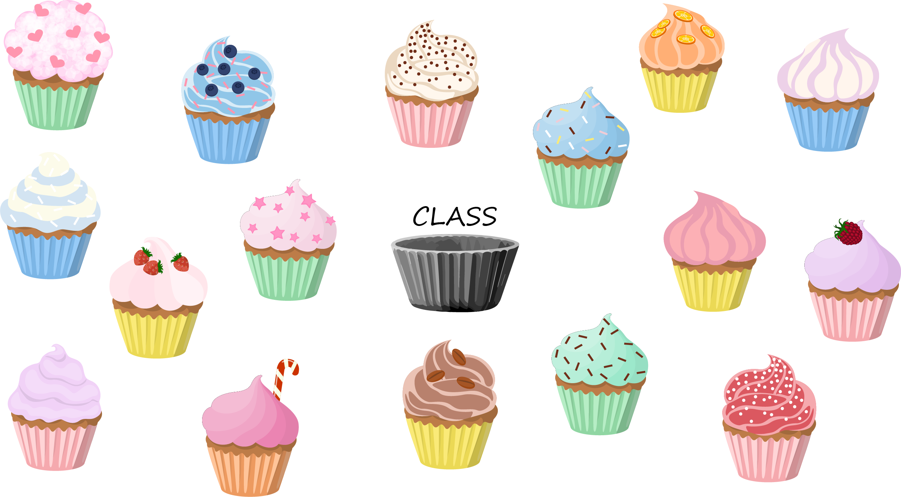

# 212 Classes and objects

The first step to understanding what an object is and how it works is understanding the relationship between a class and an object. For now, think of a class as a template or a blueprint that defines what an object will look like when created. We create objects from a class. As an analogy, imagine if we started a cupcake business. We have spent a lot of time developing the cupcake case/wrapper to ensure our cakes are tasty but also beautiful and consistent.&#x20;

The wrapper defines what a cupcake will look like when created, but it is not a cupcake. The wrapper represents our class. The variations of cupcakes on the menu are all made using the same cupcake wrapper. Using the wrapper, we can create any number of cupcakes. Our cakes could have different attributes, like varying flavours, various types of frosting, and optional extras like chocolate chips, but all the cupcakes will have the same shape because they come from the same cupcake wrapper.

<figure><figcaption>
A generic cupcake wrapper in (in black) and the various objects that belong to the class.
</figcaption></figure>

The table shows some other examples to help clarify the relationship between a class and an object.

| Class                                     | Objects                               |
| ----------------------------------------- | ------------------------------------- |
| Blueprint (plan) for a house              | House                                 |
| Sandwich listed on a menu                 | Sandwich in your hand                 |
| Cast for one-dollar coin                  | A one-dollar coin                     |
| Manuscript of a book written by an author | A physical copy of the published book |

The video contains another example of the relationship between classes and objects with a cookie-cutter analogy.


The first step to understanding what an object is and how it works is understanding the relationship between a class and an object. For now, think of a class as a template or a blueprint that defines what an object will look like when created. We create objects from a class. As an analogy, imagine if we started a cupcake business. We have spent a lot of time developing the cupcake case/wrapper to ensure our cakes are tasty but also beautiful and consistent.&#x20;


***

### Review questions

1. What is the role of a class in object-oriented programming?
2. How is an object related to a class?
3. In the cupcake analogy, what represents the class and what represents the objects?
4. Give an example from everyday life that shows the relationship between a class and an object.
5. How do the attributes of objects created from the same class vary?
