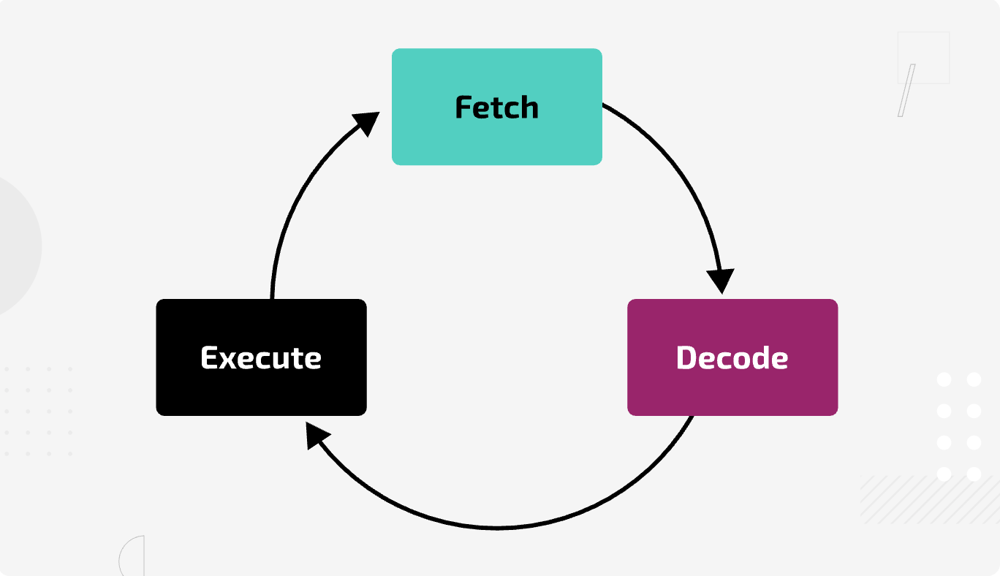

# 312 Microcontrollers and the CPU

### Overview

In this topic, we explore the role of microcontrollers and central processing units (CPUs) in mechatronic systems. Students investigate how these processing devices execute instructions, manage input and output, and influence the way code is developed for a specific platform.

### Targets

In this topic, students learn to:

* Identify the role of the CPU in computing and control
* Explain how a microcontroller differs from a general-purpose CPU
* Recognise how hardware architecture affects software design in mechatronic systems
* Select suitable control hardware for a given application

### Syllabus references

<a href="https://curriculum.nsw.edu.au/learning-areas/tas/software-engineering-11-12-2022/content/year-11/12033f12-d0e4-4902-88a8-6a4867b12232"><strong>Programming mechatronics</strong></a>

**Understanding mechatronic hardware and software**

* Identify the hardware requirements to run a program and the effect on code development\
  – assessing the relationship of microcontrollers and the central processing unit (CPU)\
  – the influence of instruction set and opcodes\
  – the use of address and data registers

### The CPU: the brain of the system

The **central processing unit** is the primary component that carries out the instructions of a program. It works by:

* Fetching instructions from memory
* Decoding what each instruction means
* Executing the instruction
* Storing the result

In a desktop or laptop, the CPU is powerful, general-purpose, and designed to handle a wide variety of complex tasks at high speed.

<figure><figcaption>
The CPU processes instructions using a continuous fetch–decode–execute loop.
</figcaption></figure>

### What is a microcontroller?

A **microcontroller** is a small, self-contained computer on a single chip. It usually contains:

* A CPU core
* Memory (RAM and flash storage)
* Input/output ports
* Integrated peripherals such as timers, ADCs (analogue-to-digital converters), or communication modules (UART, I²C, SPI)

Both microprocessors and microcontrollers have a CPU at their core, but a microprocessor is designed for flexible, general-purpose computing, while a microcontroller is an all-in-one chip optimised for specific control tasks.

Microcontrollers are optimised for specific, embedded tasks — like controlling a robot arm, reading sensor data, or driving a display — rather than running a full operating system.

**Key differences between CPUs and microcontrollers:**

| Feature           | Microprocessor (CPU)                                                                                  | Microcontroller                                                                   |
| ----------------- | ----------------------------------------------------------------------------------------------------- | --------------------------------------------------------------------------------- |
| Integration       | Is only the CPU and contains minimal components; requires external memory, I/O ports, and peripherals | Contains CPU, memory, I/O ports, and peripherals all on a single chip             |
| Primary use       | General-purpose computing in PCs, laptops, and high-performance systems                               | Embedded and dedicated applications such as robotics, appliances, and IoT devices |
| Memory            | External RAM and ROM must be connected separately                                                     | On-chip RAM and ROM/Flash storage                                                 |
| I/O ports         | Requires external I/O controllers                                                                     | Built-in I/O ports for direct device interfacing                                  |
| Power consumption | Generally higher due to external component requirements and higher clock speeds                       | Lower, optimised for low-power and battery-powered applications                   |
| Cost              | Higher overall system cost due to separate components                                                 | Lower cost for complete embedded solutions                                        |
| Speed             | Often higher clock speeds for complex tasks                                                           | Sufficient for control tasks, typically lower speeds                              |
| Example devices   | Intel Core series, AMD Ryzen, ARM Cortex-A                                                            | Arduino (ATmega328), Raspberry Pi Pico (RP2040), PIC, STM32                       |

<figure><figcaption>
A microprocessor or CPU  (left) focuses solely on processing and requires external memory and peripherals. A microcontroller (right) integrates the CPU, memory, and I/O ports into a single chip for dedicated control tasks.
</figcaption></figure>

### Why architecture matters in coding

The **instruction set architecture** (ISA) defines the set of operations a processor can perform.

* A CPU’s ISA might include hundreds of instructions for complex processing.
* A microcontroller’s ISA is streamlined for control tasks, often optimised for low power and real-time responses.

**Opcodes** are the binary codes for each instruction in the ISA. The size and structure of opcodes affect how programs are compiled and executed.

**Registers** — small storage locations within the CPU — temporarily hold data and addresses during execution. The number and type of registers impact programming efficiency and performance.

### Summary

CPUs and microcontrollers both process instructions, but their design priorities are different. CPUs offer speed and flexibility for a wide range of tasks, while microcontrollers integrate processing with peripherals for efficient control of dedicated systems. Understanding this distinction helps in choosing the right hardware for a mechatronic application.

### Questions

1. What is the primary difference between a microcontroller and a microprocessor?
2. Why are microcontrollers preferred in embedded systems?
3. What is the ESP32, and why is it significant in this context?
4. What are some common pin functions found on microcontrollers?
5. What factors should be considered when selecting components for an IoT project?

