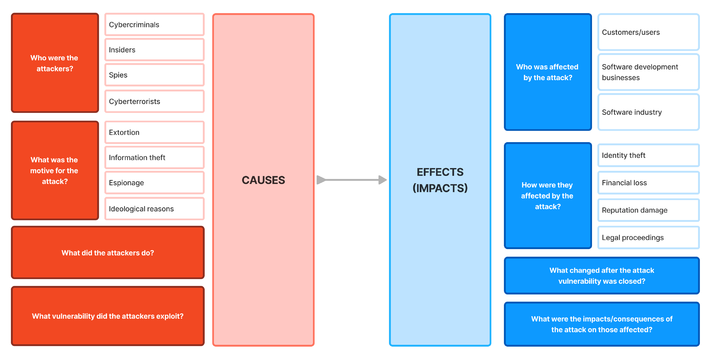

# 440.3 Analysing impacts

### TL;DR

When secure systems fail, the effects ripple beyond code and infrastructure. In this topic, students analyse how software incidents affect people, organisations, and the wider community. You’ll explore the aftermath of security breaches, service outages, and design flaws, learning how to evaluate the consequences of failure and build systems that support accountability and resilience.

### Targets

In this topic, students learn to:

* Analyse the social, legal, technical and ethical impacts of software failure and security breaches
* Explain how poor system design or response can lead to public harm and loss of trust
* Evaluate the consequences of data loss, service disruption, and regulatory non-compliance
* Reflect on the role of developers and teams in managing responsibility after a failure
* Apply impact analysis as a tool to improve future system design and incident response

### Analysing the impacts of software breaches

<figure><figcaption>
A visual organiser for analysing and responding to examination questions on the impact of a cyber-attacks.
</figcaption></figure>

The organiser divides the analysis into two main sections: **Causes** and **Effects (Impacts)**.

#### **Causes**

In this section, we focus on understanding what led to the breach.

* **Who were the attackers?**\
  Identifying whether the attackers were external hackers, insiders, or malicious organisations.
* **What was the motive for the attack?**\
  Exploring the reasons behind the breach, such as financial gain, political influence, or vandalism.
* **What did the attackers do?**\
  Describing the attackers' actions, such as stealing data, disrupting services, or altering information.
* **What vulnerability did the attackers exploit?**\
  Identifying the specific software flaw or security weakness that enabled the attack.

#### **Effects (Impacts)**

This section helps analyse the repercussions of the breach.

* **Who was affected by the attack?**\
  Determining the groups impacted, such as users, employees, or the general public.
* **How were they affected by the attack?**\
  Examining how individuals or organisations experienced harm, such as data loss, financial loss, or privacy violations.
* **What changed after the attack vulnerability was closed?**\
  Understanding how the organisation responded by implementing new security measures or policies.
* **What were the impacts/consequences of the attack on those affected?**\
  Summarising the overall effect of the breach on society, trust, or the organisation’s reputation.

### **Facebook-Cambridge Analytica Data Breach**

Let’s use the organiser to examine the Facebook-Cambridge Analytica data breach, a high-profile incident involving the misuse of personal data for political purposes.

#### **Causes**

* **Who were the attackers?**\
  Cambridge Analytica, a British political consulting firm, orchestrated the attack. It gained unauthorised access to data via a third-party app on Facebook.
* **What was the motive for the attack?**\
  The motive was to gather extensive personal data to create targeted political advertising to influence the 2016 U.S. presidential election and the Brexit referendum.
* **What did the attackers do?**\
  Cambridge Analytica collected data from users who had consented to a personality quiz app and then extended this access to capture the data of users’ friends without their explicit permission.
* **What vulnerability did the attackers exploit?**\
  They exploited Facebook’s insufficient privacy controls, which allowed third-party apps broad access to user and friend data without rigorous consent protocols.

#### **Effects (Impacts)**

* **Who was affected by the attack?**\
  Approximately 87 million Facebook users worldwide, including U.S. and U.K. users, were affected as their data was harvested without proper consent.
* **How were they affected by the attack?**\
  Users’ data, including likes, interests, and even personality traits, was used to create psychological profiles and target them with manipulative political ads.
* **What changed after the vulnerability was closed?**\
  Following public backlash and scrutiny, Facebook implemented stricter privacy policies, limiting third-party access to user data and improving transparency around data-sharing practices.
* **What were the impacts/consequences of the attack on those affected?**\
  The breach led to widespread concerns about digital privacy and data ethics, resulting in a significant loss of trust in Facebook and triggering global discussions about stricter data protection laws. Facebook faced substantial legal and financial repercussions, including a $5 billion fine from the U.S. Federal Trade Commission.
