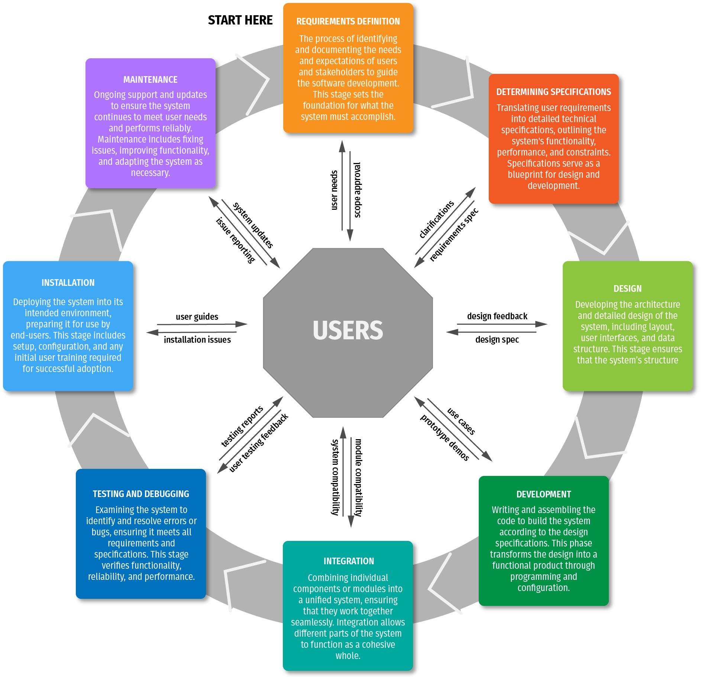
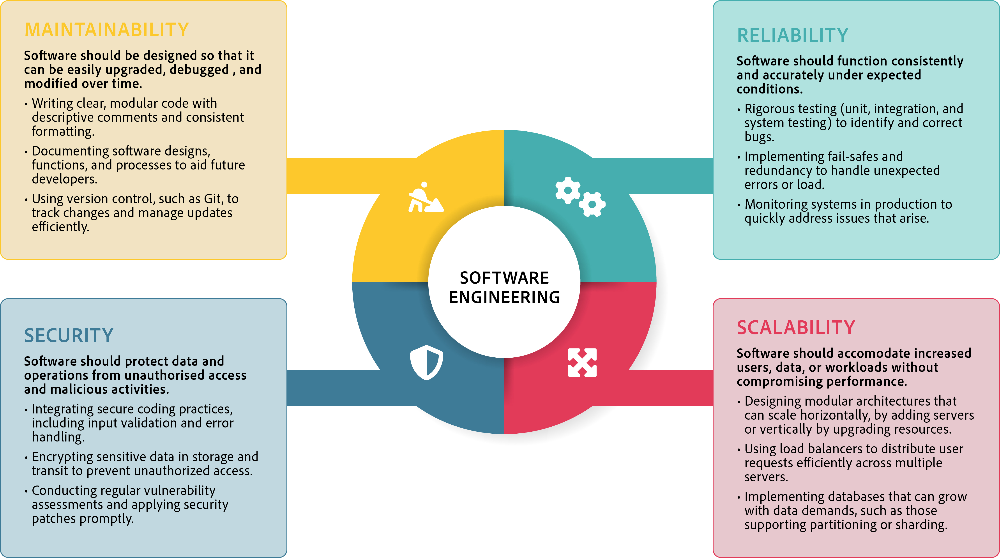

# Introduction

Imagine a bustling city filled with skyscrapers, each a testament to human ingenuity, designed to stand tall through wind, rain, and time. Every building, from the foundations to the beams to the wiring, is crafted with precision and forethought, ensuring it’s functional but also durable and safe. Now, think of software engineering similarly, but instead of buildings, it constructs digital systems that serve and connect people, streamline businesses, and improve lives. Software engineering transforms coding into a comprehensive process, building robust and reliable software systems that function effectively over time, much like the solid foundations of those skyscrapers.

In this section, we’ll explore what it truly means to approach software as an engineering discipline. We’ll dive into why software engineering is essential for today’s digital landscape and how it differs from basic programming. By the end, you’ll understand the value of designing software with reliability, scalability, and security in mind, and you’ll appreciate the diverse applications of software engineering across industries.

### Syllabus alignment


**OUTCOMES**

**SE-12-01**\
A student justifies methods used to plan, develop and engineer software solutions.


### What is software engineering?

Imagine you’re assigned a task to create an app for tracking exercise routines. You're programming if you code the essential functions — adding workouts, tracking calories, and calculating progress. But let’s say your app becomes popular, and users start requesting new features, security updates, and reliable storage for their data. Now, you’re not just coding; you’re entering the realm of software engineering, where you need a systematic approach to manage complexity, deliver quality, and ensure sustainability.

Software engineering is more than writing code; it’s the art and science of building and managing software that stands the test of time. Defined broadly, software engineering is the systematic approach to designing, developing, testing, and maintaining software applications. Unlike basic programming, it involves the entire software lifecycle, ensuring that the final product isn’t just functional, reliable, secure, scalable, and maintainable.

***

### The Software Development Lifecycle (SDLC)

The Software Development Life Cycle (SDLC) is a core concept in software engineering. The SDLC is like a blueprint for the software engineering process, guiding each phase from concept to delivery.

There are many versions of the SDLC, depending on the methodology used to develop the software. The example shown below is suited to various methods.

<figure><figcaption></figcaption></figure>

Let’s break down the SDLC into its critical stages, following the journey of our hypothetical exercise app.



### Requirements gathering

Engineers start by gathering and understanding the requirements, as an architect meets a client before drawing up plans. For our app, this means talking to potential users to find out what they need—easy logging, personalized progress charts, social sharing options, etc.



### Design

After gathering requirements, engineers plan the structure of the software. For our app, this might include designing a database for user data, determining how the interface will look, and outlining how each feature will function. This phase is crucial because it sets the foundation for everything that follows.



### Implementation

Now, coding begins. Engineers build the app feature by feature, following the design. The exercise-tracking functions, progress charts, and user accounts come to life here.



### Testing

Imagine releasing the app without knowing if it works across different devices. Testing ensures the software functions as expected under various conditions, catching bugs and flaws that could ruin the user experience.



### Deployment

The app is finally ready to be released to users. However, the job isn’t done just because the app is live; software engineering recognises that software must be monitored and improved over time.



### Maintenance

This is where software engineering shines. Regular updates, security patches, and user feedback help keep the software relevant and functional. A well-engineered app will grow and adapt to its users’ needs.



The SDLC ensures that engineers approach development systematically, reducing errors and enabling smooth adaptations to new requirements. Like building a skyscraper, the SDLC provides a step-by-step blueprint to create robust and adaptable software.

***

### Software engineering vs. programming

#### Differences in approach

Imagine two people trying to cross a river: one grabs a small boat and rows across; the other constructs a bridge. Both achieve the same outcome, but the bridge serves a broader audience and provides a long-term solution. In this analogy, programming is the boat, a tool that addresses an immediate task, while software engineering is the bridge, a systematic approach designed to serve many people over time.

Programming is primarily about writing code to solve specific, immediate problems, while software engineering is a broader discipline involving planning, designing, testing, and maintaining software solutions. Software engineers work in teams, creating solutions that aren’t just “quick fixes” but are sustainable, reliable, and scalable over time.

| Programming                                                        | Software Engineering                                                                                 |
| ------------------------------------------------------------------ | ---------------------------------------------------------------------------------------------------- |
| Primarily involves writing code to solve problems                  | Encompasses planning, designing, programming, testing and maintenance                                |
| Focused on solving immediate tasks or problems                     | Focused on creating solutions that are sustainable and long-term                                     |
| Often done by individual programmers or small teams of programmers | Usually involves collaborative efforts among larger teams of analysts, UX designers, and programmers |

#### Emphasis on maintainability, scalability, and security

Software developers must consider factors like maintainability, scalability, and security when developing software. These qualities ensure that software can grow and adapt with time, supporting more users and meeting evolving needs. In our exercise app example, software engineering would ensure that the app.

* **Maintainable**\
  It can be easily updated with new workout features and personalized settings.
* **Scalable**\
  Supports thousands of users without slowing down.
* **Secure**\
  Protects user data, such as passwords and progress stats, from unauthorized access.

These qualities distinguish software engineering from basic programming and ensure that software remains valuable and relevant over time.

***

### Goals of Software Engineering

Software engineering's main goals include reliability, scalability, security, and maintainability.&#x20;

<figure><figcaption>
The main goals of software engineering are those that distinguish it from programming.
</figcaption></figure>

Let’s explore these goals with real-world examples.

1. **Reliability**\
   Imagine banking software that occasionally miscalculates transactions or crashes during transfers. Such errors would create distrust and significant financial risks. Reliability ensures that software performs accurately and consistently, as is essential in the finance industry.
2. **Scalability**\
   Think of an e-commerce platform like Amazon during a major sales event. The platform must handle millions of transactions without slowing down. Scalability in software engineering means designing solutions that grow with demand, allowing apps and platforms to perform efficiently even as usage spikes.
3. **Security**\
   Consider a hospital’s electronic health record system. Protecting sensitive patient data requires robust security measures to guard against unauthorized access. Security is a core software engineering goal, ensuring applications remain safe from malicious threats.
4. **Maintainability**\
   Imagine a social media platform that frequently releases new features. Maintainable software allows engineers to make updates smoothly, adapting to users’ evolving needs without disrupting the platform.

***

### Applications and Impacts of Software Engineering

These goals illustrate why software engineering demands a systematic approach. Each quality is critical to creating valuable, lasting software.

Software engineering impacts virtually every industry, from healthcare to entertainment. Let’s take a journey through a few examples:

* **Healthcare**\
  In hospitals, software engineering develops systems that track patient records, manage prescriptions, and diagnose illnesses. Telemedicine, for example, is a product of software engineering. It connects doctors and patients remotely for consultations and follow-ups, bringing healthcare to patients far from hospitals.
* **Finance**\
  The world’s financial systems rely on software engineering to secure transactions, track investments, and manage vast data. Trading platforms, banking apps, and fraud detection systems require reliability and security, which software engineering principles ensure.
* **Technology**\
  Companies like Google and Apple develop various software solutions, from operating systems to cloud storage and productivity tools. In this rapidly evolving industry, scalable and maintainable software engineering practices allow tech companies to keep up with user demand and deliver innovative products.
* **Government**\
  Government agencies rely on software for everything from managing public records to enhancing public safety. A reliable and secure software system ensures essential services, like emergency response and tax processing, operate efficiently.

These examples illustrate how software engineering shapes and supports nearly every aspect of modern life. Its principles provide the foundation for reliable, scalable, secure, and maintainable systems, from the apps on our phones to the services we rely on daily.
